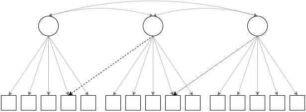

# How does the DFI algorithm work? {#algorithm}

The DFI algorithm follows Hu and Bentler’s [-@hu_cutoff_1999] approach to model misspecification in that it simulates a distribution of fit indices from a correctly specified model and a misspecified model and then chooses a cutoff value that distinguishes between the two distributions. Hu and Bentler created their misspecified models by omitting one or two cross-loadings from a three-factor model (the “complex” condition; see Figure \@ref(fig:hb)) and by omitting one or two factor correlations from the same three-factor model (the “simple” condition). The DFI algorithm mimics this approach by making the user’s model both the data generating model and the analytic model (this is the true condition). In the misspecified condition(s), the analytic model remains the user’s model, but a series of misspecifications are added to the data generating model (in line with the conventions established by Hu and Bentler). Readers interested in understanding the DFI algorithm in depth should consult McNeish and Wolf [-@mcneish_dynamic_2021;-@mcneish_dynamic_2022]. 

```{r hb, fig.cap='A path diagram of the model misspecifications used by Hu and Bentler (1999). The true data generating model has all of the loadings. The minor misspecification condition omits the loading with the dashed line from the data generating model, and the major misspecification condition omits both the dashed line and the dotted line from the data generating model. The analytic model is the same for all conditions.',fig.align='center',echo=FALSE}


```

## Multi-Factor Models

For multi-factor models, the DFI algorithm creates $f$-1 levels of misspecifications, where $f$ is the number of factors in the model. As such, a two-factor model will have one level of misspecification, while a six-factor model will have five levels of misspecification. The misspecification follows Hu and Bentler’s approach of omitting a cross-loading with a magnitude equivalent to the lowest loading in the model from the factor with the highest reliability. For example, the Level 1 misspecification will omit one cross-loading with a magnitude equivalent to the lowest loading, while the Level 2 misspecification will omit both the Level 1 cross-loading and an additional cross-loading with a magnitude equivalent to the second lowest loading in the model. The magnitude of the loading that is omitted can be found in the Info tab of the app and will be returned by default in the R package.

## One-Factor Models

The algorithm for one-factor models is unique in that it cannot exactly follow the approach established by Hu and Benter [-@hu_cutoff_1999] because it is impossible to omit factor correlations or cross-loadings in a one-factor model. As such, the DFI algorithm employs an approach inspired by Shi & Maydeu-Olivares [-@shi_effect_2020] of omitting residual correlations to create a misspecified model. One-factor models have three levels of misspecification , where Level 1 has approximately 1/3rd of items with an omitted residual correlation of .3, Level 2 has approximately 2/3rds of items with an omitted residual correlation of .3, and Level 3 has omitted residual correlations of .3 from all items. As such, the DFI algorithm for the one-factor model is standardized such that the number of items with an omitted residual correlation is proportional to the total number of items in the model, making it easier to compare degree of misfit across models.
