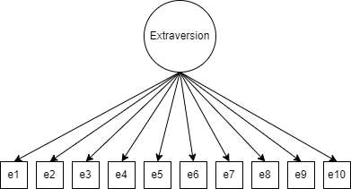
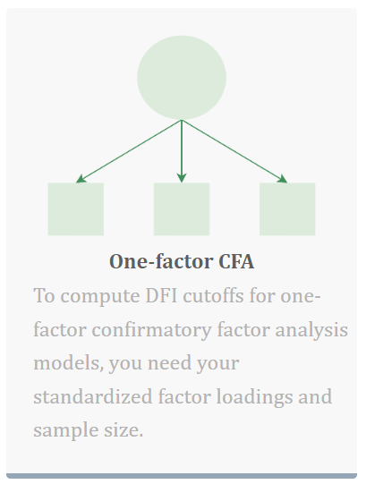

# How do I calculate DFI cutoffs? {#calculate}

DFI cutoffs can easily be computed using the free, open source, web-based Shiny application, accessible at [www.dynamicfit.app](www.dynamicfit.app). The app has a simple, user-friendly, point-and-click interface, which requires no knowledge of coding to operate. The user need only enter their model statement with standardized loadings (see Chapter \@ref(model) for more details) and their sample size. Behind the scenes, the Shiny app will use R to run a series of Monte Carlo simulations to return a continuum of cutoff values tailored to the user’s individual model. R users who wish to bypass the app can instead make use of the corresponding R package `dynamic`, available on `CRAN`, which will return the same results as the web application. 

## Applied Example

Computing DFI cutoffs is a post-hoc endeavor; in other words, users must first run their CFA model to get some of the information that is necessary to calculate custom fit index cutoffs. Thus, to make this tutorial easier to follow, we introduce an applied example which will be used throughout the rest of the paper. The data comes from a popular personality assessment commonly referred to as the “Big Five”, which was provided by the Open Source Psychometrics Project [@goldberg_development_1992]. We will use the 10-item “extraversion” factor to compute DFI cutoffs for a one-factor model (see Figure \@ref(fig:extraversion)).  

```{r extraversion, fig.cap='The one-factor model used for the demonstration in this tutorial (n = 1,222).',fig.align='center',echo=FALSE}



```

To use the Shiny application, researchers should visit the website and select the app that corresponds to their model type. In this case, we will select the one-factor CFA application (see Figure \@ref(fig:one)). The app description states that only two pieces of information are needed: (1) the user’s standardized loadings from the fitted model, and (2) the sample size. The standardized loadings will be used to create the model statement which will be uploaded to the app to compute the custom DFI cutoffs (see Chapter \@ref(model)). The function in the R package `dynamic` that corresponds to the one-factor CFA app is `cfaOne`.

```{r one, fig.cap='The one-factor CFA application on www.dynamicfit.app.', fig.align='center',echo=FALSE, out.width='40%'}


```
