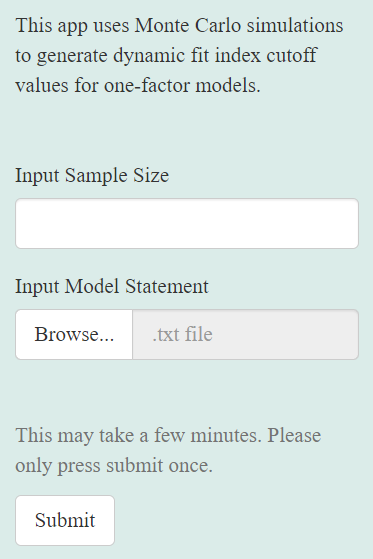
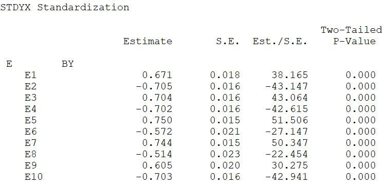
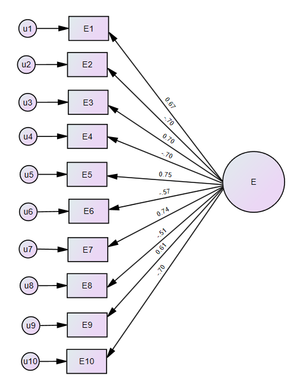
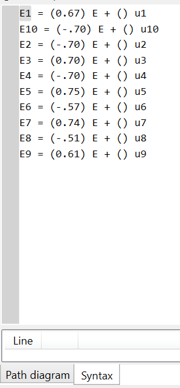

# What does a model statement look like? {#model}

After opening the one-factor CFA app, users are prompted to enter two pieces of information: (1) their sample size, and (2) their model statement (see Figure \@ref(fig:inputs)). The model statement is created using the standardized loadings from the user’s fitted model (i.e., the results from the CFA model that the user wants to calculate DFI cutoffs for). These will be found in the software output that was used to run the original CFA model. We will walk through an example from Mplus and Amos using the Extraversion factor from the Big 5 dataset provided.

```{r inputs, fig.cap='The required inputs for the one-factor CFA app.', echo=FALSE,fig.align='center',out.width='40%'}


```

## Mplus

To get the standardized loadings from Mplus (current as of version 8.7), we add the following argument to the end of the input file: `OUTPUT: STDYX;` . The standardized loadings will be found under the section of the output titled `STDYX STANDARDIZATION` (see Figure \@ref(fig:mplus)). The magnitude of the standardized loading for each indicator is under the header titled Estimate. For example, the standardized loading for E1 is .671.

```{r mplus, fig.cap='The standardized loadings from Mplus.', echo=FALSE, fig.align='center',out.width='70%'}



```

## SPSS Amos

To get the standardized loadings from SPSS Amos (current as of version 28), users should select the “Analysis Properties” icon, and check the “Standardized estimates” box under the “Output” tab. After running the model, the standardized loadings can be found in the “Parameter Formats” box by deselecting “Unstandardized estimates” and selecting “Standardized estimates”. They will appear on the path diagram and can easily be copied from the syntax. The syntax can be accessed by toggling to the “Syntax” tab underneath the path diagram (see Figure \@ref(fig:amos)).

```{r amos, out.width=c('50%','30%'),fig.cap='A path diagram with standardized loadings from Amos, and the standardized loadings as seen in the Amos Syntax tab.', fig.show='hold', fig.align='center',echo=FALSE}




```

## Model Statement

We will use the standardized loadings from Mplus and Amos to write out the model statement.  Note that the model statement must be saved in a .txt file to be uploaded to the app. The easiest way to create a .txt file on a PC is in Notepad, while the easiest way on a Mac is in TextEdit (make sure to save your TextEdit file as plain text).

The model statement should be written in lavaan style syntax . The regression relationship between the factor and any items will use the syntax =~, while any correlational relationships (e.g., between factors or items) will use the syntax ~~. The model statement for this one-factor CFA model will be written as:

$$ Extraversion =~ .671*E1 + -.705*E2 + .704*E3 + -.702*E4 \\ 
+ .750*E5 + -.572*E6 + .744*E7 + -.514*E8 + .605*E9 + -.703*E10 $$

As seen above, the model statement follows the following format: Factor = item loading magnitude * item name. Because the first loading had a magnitude of .671, it is written as .671\*E1. The magnitude of the loading will always come before the name of the item. The factors and items can have any name (e.g., orange =~ .671\*apple would work), however the name cannot start with a number (e.g., 123orange would not be permissible). Note that negative loadings still need to have a + sign as a link in the model statement (e.g., .671\*E1 + -.705\*E2). This model statement would then be saved as a .txt file and uploaded to the app along with the sample size (in this case, the sample size is 1,222). Users would then press submit to begin the simulation. 
