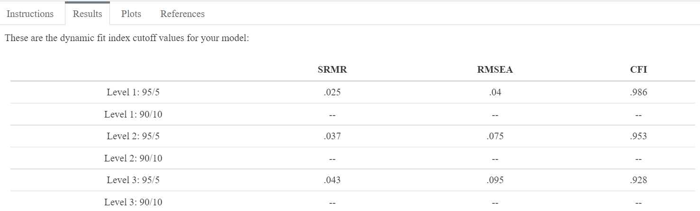

# Why are there different levels and what do they mean? {#levels}

After submitting the model statement and the sample size, the app will compute several Monte Carlo simulations (each with 500 replications) to return the DFI cutoffs. Once the busy bar finishes running, the DFI cutoffs will be found under the “Results” tab. For most models, there will be a series of cutoff values beginning with “Level 1”. One-factor models will typically have three levels of cutoff values . Figure \@ref(fig:output-one) displays the three levels of DFI cutoffs for the model used in this tutorial. 

```{r output-one, fig.cap='The DFI cutoffs for the model used in this tutorial.',fig.align='center',echo=FALSE,out.width='100%'}



```

The levels correspond to increasing degrees of misspecification in the fit of the model, enabling researchers to reconceptualize misfit as a continuum analogous to an effect size measure. Misspecifications are cumulative such that higher levels are equivalent to more egregious model misspecifications. The Level 1 cutoff can therefore be thought of as the strictest fit criteria because it is consistent with the smallest misspecification from the misfit continuum. Thus, the ideal outcome would be if a user’s fitted values for their SRMR, RMSEA, and CFI were all below the Level 1 cutoff, because this would indicate that the observed fitted values were more similar to a model that was correctly specified. In other words, if the user’s model fit was below the Level 1 cutoffs, that would mean it fit better than a model that had only a minor misspecification. As the levels increase, the cutoff values will become more lenient because they will correspond to models that are more misspecified. 

If the fitted values for a one-factor model were above the Level 1 cutoff but below the Level 2 cutoff, one might conclude that their model was consistent with modest misspecifications and could potentially argue that the misspecifications were not a substantial threat to the validity of their inferences. If the fitted values were above the Level 2 cutoff but below the Level 3 cutoff, the model fit might be categorized as moderately misspecified, while fitted values above the Level 3 cutoff might be described as substantially misspecified. It is also possible to observe fitted values for each of the indices that are classified at differing cutoff levels. In this case, the researcher might report that the fit indices were consistent with different degrees of misspecification, and potentially attempt to diagnose the inconsistencies (e.g., by investigating local areas of strain). As always, it is up to the researcher to present multiple types of evidence in defense of the validity of their assessment (e.g., finding fit consistent with a minor misspecification should not be the entirety of the claim for evidence of validity). See Chapter \@ref(algorithm) for more discussion about levels and model misspecification.

## Applied Example

To determine how well their model fits their data, researchers should compare the fit of their model (derived from their software of choice) to the DFI cutoffs derived from the app or the R package. In this case, the fit index values for the Extraversion empirical model are ${\chi}^2$ = 436.55 (df = 35, p < .001), SRMR = .048, RMSEA = .097 [.089, .105], CFI = .921. Compared to the traditional fixed cutoff values from Hu and Bentler [-@hu_cutoff_1999], the SRMR would be indicative of good fit while the RMSEA and the CFI would be indicative of poor fit.

There are two drawbacks to using the fixed cutoffs. The first is that the fixed cutoffs are derived from a different model subspace (a 3-factor model with 15 items) that does not generalize to our model (a one-factor model with 10 items). The second is that because there is only one set of cutoff values, we cannot infer the degree of misspecification present, forcing us to make a binary decision about a continuum of misspecification. Alternatively, when comparing our fit index values to the DFI cutoffs that are tailored to our empirical model, we see that all three indices are consistent with a Level 3 misspecification (see Figure \@ref(fig:output-one)). This is because the SRMR and RMSEA are greater than the Level 3 DFI cutoff, while the CFI is less than the Level 3 DFI cutoff. As such, we can infer that the model is substantially misspecified, rendering it difficult to defend as valid especially without other types of validity evidence. We might follow up by investigating local fit such as consulting the modification indices in our software of choice. In doing so, we see that adding a residual correlation between E8 and E9 would reduce the ${\chi}^2$ by 156.158, or 36%. The next steps might involve qualitatively investigating the cause of the relationship between these two items, removing one of them if they are deemed redundant, adding a residual correlation between the two of them if it is theoretically justified, or something else.

