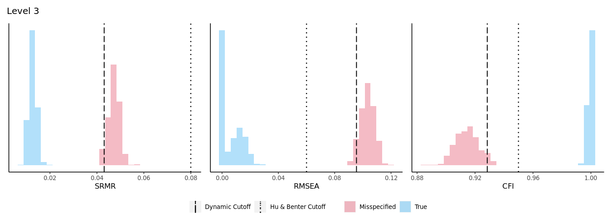

# What does 95/5 and 90/10 mean, and how should I interpret the plots? {#ninetyfive}

The 95/5 and 9/10 thresholds are derived from Hu and Bentler’s approach to minimizing the classification error rates. In Chapter \@ref(algorithm), we mentioned that the DFI algorithm simulates a distribution of fit index values from a correctly specified model and a misspecified model and then selects a cutoff value that distinguishes between the two distributions. In the app, these distributions are visualized under the “Plots” tab (see Figure \@ref(fig:one-graph) for the Level 3 distributions from the applied example). But how is that value selected, especially when the distributions might overlap leaving researchers unsure as to whether the fit index value that they observed is consistent with one that is derived from a misspecified model or a correctly specified model? 

```{r one-graph, echo=FALSE, fig.cap='The Level 1 distributions from the DFI algorithm for the Extraversion scale.',fig.align='center', out.width='100%'}



```

To avoid ambiguity, the DFI algorithm consistently selects the cutoff value from the misspecified distribution. Specifically, the magnitude of the cutoff value corresponds to the 5th percentile of the misspecified distribution for the SRMR and RMSEA and the 95th percentile of the CFI (this is because low values of SRMR and RMSEA are indicative of better fit while high values of CFI are indicative of better fit). These values correspond to the dashed lines in Figure \@ref(fig:one-graph) (the Hu and Bentler cutoffs are also presented for comparison as dotted lines). Since the fitted value for the SRMR in the Extraversion example was .048, it is more likely that this value would come from a distribution of misspecified fit indices because the SRMR misspecified distribution (in red) ranges from .041 to .056, while the SRMR correctly specified distribution (in blue) ranges from .008 to .019. As such, the conclusion is that the fitted model is likely misspecified in a way that is consistent with a Level 1 misspecification. 

In Figure \@ref(fig:one-graph), the two distributions are distinct and clearly separated. However, sometimes the misspecified and the correctly specified distributions will overlap. Since the distributions can overlap, the rule that the DFI algorithm uses is to select the 5th percentile of the misspecified distribution (for the SRMR and RMSEA) so long as the value that is returned is also greater than the 95th percentile from the correctly specified distribution . This check is put in place to safeguard against mistakenly choosing a cutoff value that could just as easily come from a correctly specified distribution. If the distributions overlap too much, (such that the 5th percentile of the misspecified distribution is less than the 95th percentile of the correctly specified distribution), then the DFI algorithm will attempt to return the 10th percentile of the misspecified distribution so long as the value is greater than the 90th percentile of the correctly specified distribution. Conceptually, this is like changing the alpha from .05 to .10 in standard null hypothesis significance testing. As such, the probability of misclassification is higher with the 90/10 rule than with the 95/5 rule, but the overall likelihood of making an error is still reasonably low [@mcneish_dynamic_2022].

