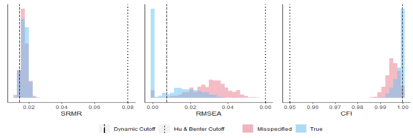

# What does NONE mean, and what should I do if I see it? {#none}

In Chapter \@ref(ninetyfive), we spoke about how the cutoff values are derived from the 5th percentile of the misspecified distributions of fit indices (for SRMR and RMSEA; the 95th percentile for CFI), and the problems that begin to arise if the misspecified and correctly specified distributions overlap. If the misspecified and correctly specified distributions of fit indices overlap substantially, then we become unsure as to whether an observed fitted value would be more likely to be found in a distribution of fit indices that were derived from a correctly specified model or a misspecified model. An example of this can be seen in Figure \@ref(fig:overlap). When this happens, the DFI algorithm will return the word “NONE” for that fit index. 

```{r overlap, fig.cap='An example of overlapping distributions that would result in a NONE outcome.',echo=FALSE,fig.align='center',out.width='100%'}



```

When the word “NONE” is returned, that means that there are no cutoff values for that level of misfit that can reliably distinguish between a correctly specified model and a misspecified model. This can be verified visually in the “Plots” tab of the app. This is more likely to happen when sample sizes are small and loadings are low [@hancock_reliability_2011; @heene_masking_2011; @mcneish_thorny_2018]. If there are DFI cutoff values available for other indices or other levels, they can and should still be used. If there are no DFI cutoff values available for any indices or any levels, the solution is not to rely on the traditional fixed cutoff values from Hu and Bentler as they similarly cannot distinguish between a correct and misspecified model. Instead, users can attempt to collect more data to increase their sample size, rely on the ${\chi}^2$ test, or investigate local fit. 
